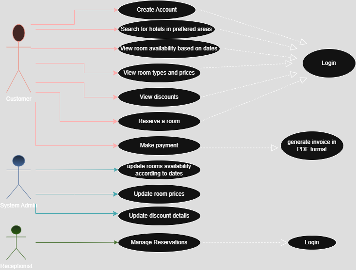

# Requirement-Analysis in Software Development

## Introduction

This repository is dedicated to exploring the crucial process of requirement analysis in software development. It includes documentation, and examples, that demonstrate how to effectively gather, analyze, and manage software requirements. Whether you're a student, developer, or project manager, this repository aims to provide a foundational understanding of requirement analysis and its role in successful software projects.

## What is Requirement Analysis?

### Requirement Analysis is the process of understanding what a software application needs to do before building it. 
This is the first and most important steps in the Software Development Lifecycle (SDLC).
The project team gathers, analyzes, and defines the requirements of the software product to be developed.

Why is Requirement Analysis Important in SDLC?

Clear Goals: It helps everyone understand what the stakeholders expect from the software reducing confusion.

Scope Definition: Clearly defines the scope of the project, which helps in preventing scope creep.

Improves Design And Development: Developers and designers can create better solutions when they know exactly what users need.

Helps Testing: Clear requirements help testers know what to check to make sure the software works properly.

Better Planning: Effective estimation of timelines, costs, and resources.

Increases Success: Software built according to specified requirements is more likely to meet user expectations.

## Key Activities in Requirements Analysis.

Gathering Requirements – Talking to users, clients, and stakeholders to understand their needs and expectations. 

Requirement Elicitation – Conducting brainstorming sessions to generate ideas and gather requirements.

Documenting Requirements –  Creating a detailed document that lists all functional and non-functional requirements. 

Requirement Analysis and Modeling – Making sure the requirements are complete, realistic, and agreed upon by all.

Requirement Validation – reviewing the documented requirements with stakeholders, and keeping track of updates or changes in the requirements during the project to ensure accuracy and completeness.

## Types of Requirements:

### Functional Requirements: What the software should do 
Examples for Functional Requirements for the booking management project:

-User Registration and Login
Users (guests and hotel managers) must be able to sign up, log in, and securely access their respective dashboards.

-Hotel Listing Management
Hotel managers can add, update, or remove hotel listings, including room details, pricing, availability, and images.

-Hotel Search and Filtering
Customers can search for hotels by location, availability, price range, and amenities. 

-Hotel Booking Process
Customers can book rooms by selecting dates, number of guests, and room type. Bookings are stored in the Booking Database and temporarily cached in Redis for fast access.

-Payment Integration
The system must process payments using third-party payment gateways during the booking process.

-Booking History and Management
Both customers and hotel managers can view and manage past and current bookings via the View Booking Service, with recent data served from Redis and archived data from Cassandra.

-Notifications
The system sends real-time notifications (e.g. booking confirmation, new offers) using Kafka messaging and a notification service.

### Non-Functional Requirements: How the software should behave 
Examples for Non-Functional Requirements for the booking management project:

-Scalability
The system must handle large volumes of traffic and data using a microservices architecture, Kafka, ElasticSearch, and Cassandra to scale horizontally.

-Performance
Fast response times for search and booking are critical. Redis caching reduces API latency and improves user experience.

-Availability and Reliability
Use of load balancers and database replication (Master-Slave architecture) ensures high availability and fault tolerance.

-Security
Secure login, encrypted communication, and safe payment processing to protect user data and transactions.

-Data Archiving and Analytics
Older booking data is archived in Cassandra, and big data is analyzed via Apache Streaming and Hadoop for business insights.

## Use Case Diagrams.

A Use Case Diagram represents the interaction between actors/users and a system.
It provides a high-level view of the system's functionality by illustrating the various ways users can interact with it.

Some benefits of of Use Case Diagram include, simplifying complex systems, helps identify user needs, improves system design, clarifies system requirements.

## Acceptance Criteria
Acceptance Criteria are clear and specific conditions that a software feature must meet to be accepted by stakeholders.

### Why Acceptance Criteria is important? 

Defines "Done": Helps determine when a user story or task can be marked as finished.

Clarifies Expectations: Helps define exactly what needs to be delivered for a feature to be considered complete.

Guides Development: Developers use it to build features that match user needs.

Supports Testing: Testers use it to verify if the feature works correctly.

Reduces Miscommunication: Everyone—developers, testers, business analysts, and clients—is aligned on the outcome.

Examples include:
-Payment must be processed via a secure third-party payment gateway.

-On successful payment, a confirmation message must be shown and an email receipt sent to the customer.

-Failed payments must display a clear error message with retry options.

